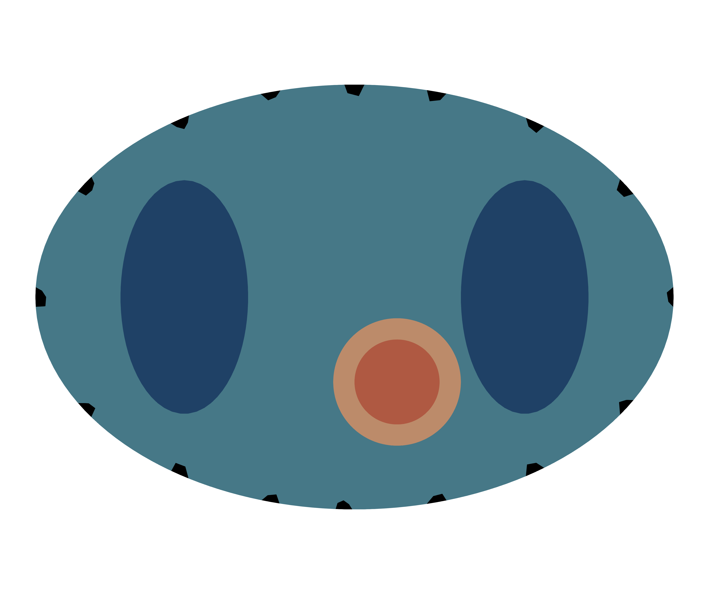

# LEARNED FEM REGULARIZATION FOR ECGI

The repository contains the implementation of **Learned Finite Element-based Regularization of the Inverse Problem in Electrocardiographic Imaging** designed for solving space-time inverse problems describen in [Haas et al. (2026)](https://arxiv.org/abs/2602.07466), with a specific application to **Electrocardiographic Imaging (ECGI)** on a torso-heart model with heart domain $\Omega_H$, torso domain $\Omega_0$ including lungs, epicardium $\Gamma_H$, torso boundary $\Gamma$ and body surface electrodes $\Sigma$. Both a 2D torso-heart cross-section and a full 3D biventricular model are supported.
<p align="center">
  
</p>

The project includes a complete pipeline for:
1.  Generating synthetic cardiac electrophysiology data using Finite Element Methods (FEM), on 2D or 3D torso-heart meshes.
2.  Training a deep learning model (`MFoE_temp`) to reconstruct cardiac potentials.
3.  Comparing the learned model against classical spatiotemporal baseline methods (Tikhonov Regularization, Total Variation).

## Features

*   **Synthetic Data Generation**: Simulates cardiac electrical activity using a monodomain model with Nagumo ionic dynamics, on either a 2D torso-heart cross-section or a full 3D biventricular heart with rule-based (LDRB) fiber directions (see `data_generation/README.md`).
*   **Deep Learning Model**: Implements a space-time multivariateField of Experts model based on [Ducotterd et al. (2025)](https://arxiv.org/pdf/2508.06490?) using PyTorch, incorporating FEM operators (Mass, Gradient) directly into the network architecture.
*   **Baseline Methods**: Includes GPU-accelerated implementations (via CuPy) of classical regularization techniques:
    *   (`zero`)- and (`first`)-order Tikhonov (`TIK`) Regularization solved using the conjugate gradient method.
    *   Anisotropic (`l1`) and isotropic (`l2`) Total Variation (`TV`) using Primal-Dual Hybrid Gradient algorithms. The space-time TV implementation is based on the work of [Haas et al. (2025)](https://doi.org/10.1137/24M1685055).
*   **Inverse & Denoising**: Supports both direct denoising of mesh functions and solving the ill-posed inverse problem from sparse torso electrode measurements.

## Requirements

*   Python 3.11
*   CUDA-capable GPU (recommended for training and CuPy baselines)

### Dependencies

Install the required Python packages from the environment file `environment.yaml`:

```bash
conda env create -f environment.yaml
conda activate ECGI_FEM
```

This installs PyTorch, NumPy/SciPy/pandas/matplotlib, TensorBoard, `scikit-sparse`, `vtk`, `h5py`, and (via pip) `scikit-fem`, `meshio`, `pyvista`, `cupy-cuda11x` (adjust the CUDA version to your system), `torchdeq`, and `tetgen`.

## Usage

### 1. Data Generation

Before training, you must generate the synthetic dataset and the fixed FEM operators, for either the 2D or the 3D model (see `data_generation/README.md` for details):

```bash
python data_generation/gen_data_2D.py   # or gen_data_3D.py
```

This script performs the following:
*   Generates synthetic cardiac potential samples based on `data_generation/config_data_2D.json` (resp. `config_data_3D.json`) including scar tissue.
*   Computes the forward problem to map potentials to torso electrodes.
*   Saves the dataset to `data/2D/data_functions/` (resp. `data/3D/...`).
*   Precomputes FEM matrices (Mass, Stiffness, Projection, observation operator) and saves them to `data/2D/data_fixed/` (resp. `data/3D/...`).
*   Splits data into train/test/val CSV files, and computes global normalization stats.

### 2. Training

To train the MFoE model run:

```bash
python train.py --device cpu  # or cuda:n; --config defaults to training/config_train.json
```

**Key Configuration Options (`training/config_train.json`):**
*   `dim`:              `"2D"` or `"3D"` -- selects which `data/<dim>/` dataset to train on.
*   `logging_info`:     Directory paths for logs and checkpoints.
*   `model_params`:     Specifies the problem type ("inverse" or "denoise"), the loss function ("L2" or "H1"), and the model architecture.
*   `optimization`:     Forward and backward pass parameters.
*   `training_options`: Learning rates and number of iterations.

Training automatically resumes from the latest checkpoint in `logging_info.log_dir/exp_name/checkpoints/` if one exists.

Training progress, including loss curves and parameter visualizations, can be monitored using TensorBoard:

```bash
tensorboard --logdir trained_models/
```

### 3. Reconstruction & Evaluation

To evaluate the trained model or run baseline reconstruction methods:

```bash
python reconstruct.py --device cuda:n  # or cpu for MFoE; --config defaults to problems/config_recon.json
```

**Key Configuration Options (`problems/config_recon.json`):**
*   `logging_info`: Directory paths for logs.
*   `regularizer`:  Choose between `"MFoE"` (learned model) or `"base"` (classical methods).
*   `dim`:          `"2D"` or `"3D"` -- selects which `data/<dim>/` dataset to reconstruct on (defaults to `"2D"`).
*   `method`:       The `problem` parameter can be chosen either `"denoise"` or `"inverse"` for the inveres problem of ECGI. `reg` denotes either the base method `TIK` or `TV` or the learned model name. The `norm` parameter determines the specific type of regularization (`zero` or `first`/`l1` or `l2`).
*   `tune`:         Whether to perform hyperparameter tuning (finding optimal $\lambda$, $\sigma$).


## Structure

```text
temporal_foe/
├── data/                       # Dataset and fixed FEM operators
│   ├── meshes/2D/, meshes/3D/  # Raw torso/heart mesh assets (input to data generation)
│   └── 2D/, 3D/                # Generated data_functions/, data_fixed/, data_csv/, plots/
├── data_generation/            # Synthetic data creation
│   ├── gen_data_2D.py          # 2D generation script
│   ├── gen_data_3D.py          # 3D generation script
│   ├── utils_data.py           # FEM and mesh utilities shared by both
│   ├── config_data_2D.json     # 2D simulation parameters
│   └── config_data_3D.json     # 3D simulation parameters
├── models/                     # PyTorch model definitions
│   ├── base_methods.py         # Baseline methods (Tikhonov, TV) in CuPy
│   ├── mfoe.py                 # Main multivariate FoE temporal model
│   ├── l_operator.py           # Learned operator layers
|   └── optimization.py         # Acclerated gradient descent algorithm
├── problems/                   # Reconstruction / hyperparameter search
│   ├── config_recon.json       # Reconstruction parameters
│   └── utils_recon.py          # Reconstruction utilities
├── trained_models/             # Checkpoints of trained models
├── training/                   # Training of MFoE model
│   ├── config_train.json       # Training configuration
│   └── trainer.py              # Training loop and validation
├── environment.yaml            # Conda environment definition
├── plot.ipynb                  # Visualization notebook
├── reconstruct.py              # Inference and comparison script
├── train.py                    # Training entry point
└── utils.py                    # General utilities (loading, noise, dataset)
```
