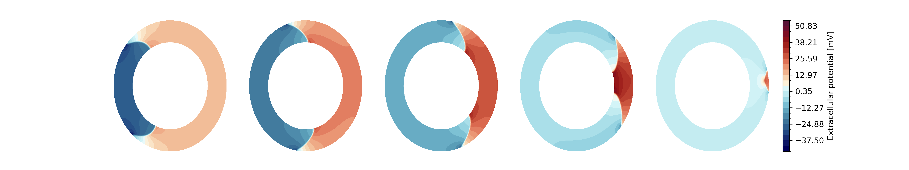
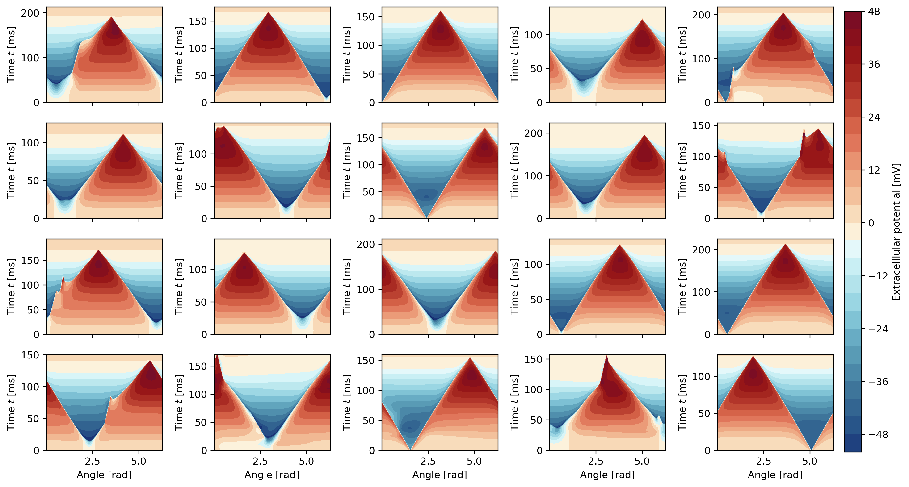

# DATASET GENERATION ON A 2D TORSO-HEART-MODEL

This directory contains the scripts required to generate synthetic cardiac electrophysiology data and the associated Finite Element Method (FEM) operators used for the inverse problem of Electrocardiographic Imaging (ECGI).

## Overview

The data generation pipeline simulates cardiac electrical activity on a 2D heart mesh and maps the resulting potentials to electrodes on a torso surface. The simulation uses:
*   **Monodomain Model**: Describes the propagation of action potentials in the heart tissue.
*   **Nagumo Ionic Model**: A simplified phenomenological model for cardiac excitation.
*   **Scar Tissue**: Randomly generated regions of low conductivity to simulate pathology.
*   **Forward Problem**: Solves the Laplace equation in the torso volume to map epicardial potentials to body surface potentials.

Example simulation of extracellular potential on myocardium mesh:
  

### Epicardium potential dataset as space-time cyclinders
  

This script performs the following steps:
1.  **Simulation**: Generates `data_nb` samples of cardiac potentials.
2.  **Fixed Operators**: Precomputes and saves time-independent FEM matrices (Mass, Stiffness, Transfer operators).
3.  **Data Splitting**: Creates CSV files defining training, validation, and test splits.

## Configuration

The generation process is controlled by `data_generation/config_data.json`. Key parameters include:

*   **Dataset Size**: `data_nb` determines the number of samples.
*   **Time**: `Tend` (end time), `dt_range` (time step size), `sample_range` (sampling rate).
*   **Physiology**: Parameters for the membrane (`Cm`, `beta`) and ionic model (`gmax`, `Vrest`, etc.).
*   **Conductivity**: Ranges for intracellular and extracellular conductivities (`bidomain_cond`).
*   **Pathology**: Probability and properties of scar tissue (`scar`).

## Output Structure

The script populates the `data/` directory (created in the project root) with the following structure:

*   `data/data_functions/`: Contains individual simulation samples (`.npz` files) with ground truth potentials (`u`) and time steps (`dt`).
*   `data/data_fixed/`: Contains precomputed operators:
    *   `fixed_data.npz`: Mass matrix (`M`), Stiffness matrix (`Ks`), Forward operator (`A`), etc.
    *   `fixed_data_base.npz`: Operators specific to baseline methods.
*   `data/data_csv/`: Contains `train.csv`, `test.csv`, and `val.csv` listing the filenames for each split.
*   `data/plots/`: (Optional) Visualization of generated samples if `plot` is enabled in config.
