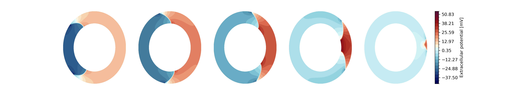
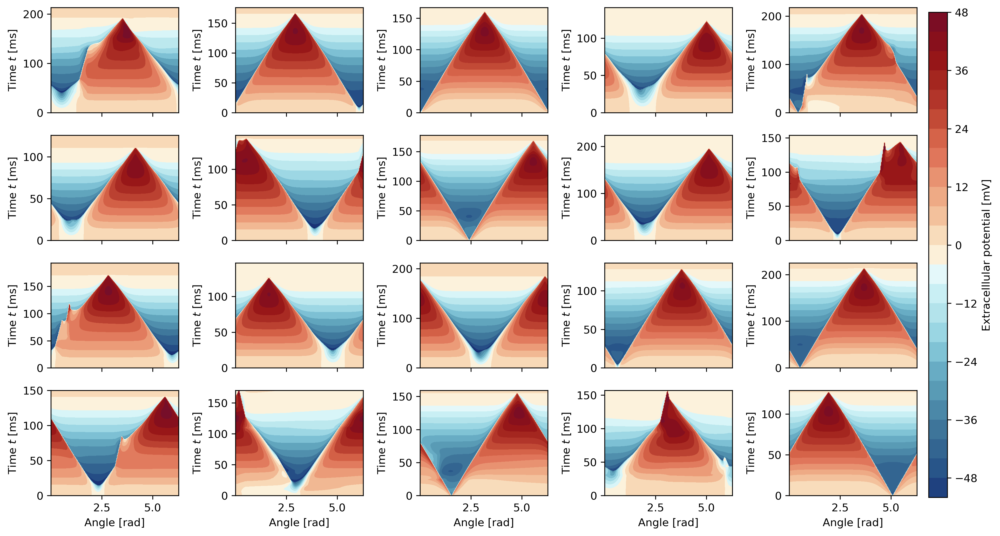

# DATASET GENERATION ON 2D AND 3D TORSO-HEART MODELS

This directory contains the scripts required to generate synthetic cardiac electrophysiology data and the associated Finite Element Method (FEM) operators used for the inverse problem of Electrocardiographic Imaging (ECGI), on either a 2D or a 3D torso-heart model.

## Overview

The data generation pipeline simulates cardiac electrical activity on a heart mesh and maps the resulting potentials to electrodes on a torso surface. The simulation uses:
*   **Monodomain Model**: Describes the propagation of action potentials in the heart tissue.
*   **Nagumo Ionic Model**: A simplified phenomenological model for cardiac excitation.
*   **Scar Tissue**: Randomly generated regions of low conductivity to simulate pathology.
*   **Forward Problem**: Solves the Laplace equation in the torso volume to map epicardial potentials to body surface potentials.<p align="center">

Example simulation of extracellular potential on myocardium mesh:
  
</p>


### Epicardium potential dataset as space-time cyclinders
  
</p>

There are two independent generation scripts, sharing common FEM/mesh utilities in `utils_data.py`:

*   **`gen_data_2D.py`** (class `GenData2D`): 2D torso/heart cross-section, using a fixed-refinement simulation mesh (`data/meshes/2D/`). Configured via `config_data_2D.json`.
*   **`gen_data_3D.py`** (class `GenData3D`): 3D biventricular heart with rule-based (LDRB) fiber directions, embedded in a full 3D torso (`data/meshes/3D/`). Configured via `config_data_3D.json`. Also draws stimulation from three fixed anatomical pacing sites (LV, RV, APEX) instead of a random location, and places electrodes on the torso surface via farthest-point sampling instead of a fixed layout.

Both scripts perform the same four steps:
1.  **Fixed Operators** (`gen_fixed_data`): Precomputes and saves the time-independent FEM matrices used by the reconstruction problem (spatial mass matrix `M`, spatial gradient `Ks`, forward/observation operators `A`/`A_obs`, projection `proj_p1`), and caches expensive one-time results on disk so reruns skip already-computed operators.
2.  **Simulation** (`gen_dataset`): Generates `data_nb` samples of cardiac potentials, each saved with its normalized (post-`compute_normalization_stats`, see below) ground truth `u` (reconstruction-mesh epicardial potential), `u_fine` (the finer-mesh epicardial potential used to build noisy electrode observations), `y` (the corresponding clean electrode observation) and the sample's time step `dt`.
3.  **Data Splitting** (`gen_csv`): Creates `train.csv`/`test.csv`/`val.csv` files listing the filenames for each split.
4.  **Baseline Operators** (`gen_data_base_methods`): Precomputes the additional FEM operators needed by the CuPy baseline methods (`models/base_methods.py`).

`compute_normalization_stats(dim)` is run once at the end of `main()` and computes global, train-set-only min/max stats over both `u` and `u_fine`, saved to `data_fixed/normalization.npz` -- `dataset_ecgi` (in `utils.py`) uses these (not a per-sample min/max) to normalize every sample consistently.

Run either script from the project root, e.g.:

```bash
python data_generation/gen_data_2D.py
python data_generation/gen_data_3D.py
```

## Configuration

Each script reads its own JSON config (`config_data_2D.json` / `config_data_3D.json`). Common parameters include:

*   **Dataset Size**: `data_nb` determines the number of samples.
*   **Time**: `Tend` (end time), `dt_range` (time step size), `sample_range` (sampling rate).
*   **Physiology**: Parameters for the membrane (`Cm`, `beta`) and ionic model (`gmax`, `Vrest`, etc.).
*   **Conductivity**: Ranges for intracellular and extracellular conductivities (`bidomain_cond`).
*   **Pathology**: Probability and properties of scar tissue (`scar`).
*   **Plotting**: `plot` / `n_plot_samples` optionally save per-sample visualizations to `data/<dim>/plots/`.

`config_data_3D.json` additionally has `torso.sigma_torso`, `electrodes.n_electrodes` (electrode count, placed via farthest-point sampling), `stim_radius_frac` / `scar.rad_frac` (as fractions of heart size, rather than absolute units), and `sim_mesh_refine_levels` (refinement of the simulation-only mesh, separate from the coarser mesh the inverse problem is discretized on).

## Output Structure

Each script populates `data/<dim>/` (`data/2D/` or `data/3D/`, created in the project root) with:

*   `data/<dim>/data_functions/`: Individual simulation samples (`.npz` files) with `u`, `u_fine`, `y`, and `dt`.
*   `data/<dim>/data_fixed/`: Precomputed operators:
    *   `fixed_data.npz`: Mass matrix (`M`), spatial gradient matrix (`Ks`), forward operator (`A`), etc.
    *   `fixed_data_obs.npz`: The fine-mesh electrode observation operator (`A_obs`), used to generate noisy inverse-problem observations from `u_fine`.
    *   `fixed_data_base.npz`: Operators specific to the CuPy baseline methods.
    *   `normalization.npz`: Global train-set min/max stats used to normalize `u`/`u_fine`.
    *   3D only -- `fixed_data_interp.npz`: The fine-to-sparse interpolation operator (`P_fine_to_sparse`), cached separately since it's expensive to rebuild.
*   `data/<dim>/data_csv/`: `train.csv`, `test.csv`, and `val.csv` listing the filenames for each split.
*   `data/<dim>/plots/`: (Optional) Visualization of generated samples if `plot`/`n_plot_samples` is enabled in config.

Both scripts read their raw mesh assets from `data/meshes/<dim>/` (torso/heart surface and volume meshes, electrode indices) -- these are pre-built inputs, not generated by these scripts.
